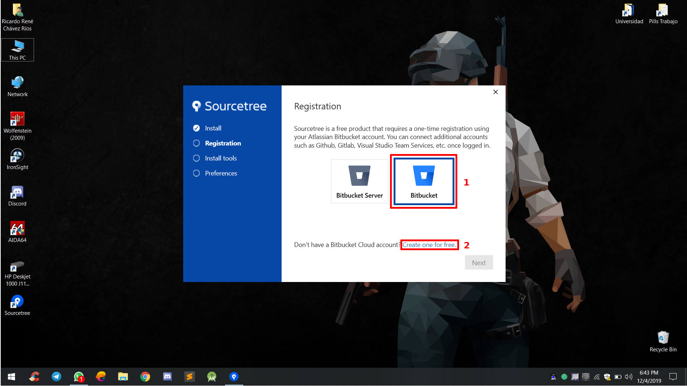

# SourceTree Tutorial

## Instrucciones sobre la instalación y uso de SourceTree para el control de versiones de los proyectos de feria realizados por los estudiantes de CS50x.ni

#### ¿Qué es SourceTree?

SourceTree simplifica la forma en que interactúa con sus repositorios de Git para que pueda concentrarse en la codificación. Permite visualizar y administrar sus repositorios a través de una sencilla interfaz de usuario que provee la aplicación.

#### Instalación

* Visite el sitio web oficial de [SourceTree](https://www.sourcetreeapp.com/) y de click sobre el botón de descarga.

* Una vez descargado el archivo, ejecute el mismo con permisos de administrador para iniciar el asistente de instalación de la aplicación.

* Finalizado el primer paso del asistente de instalación, a continuación, procedemos a dar click en **Bitbucket** (1) e ingresar las credenciales de nuestra cuenta. En caso de no tener una cuenta, creamos una nueva (2).

Si todo sale bien con el registro de la cuenta aparecerá el siguiente mensaje, lo que  indica que podremos continuar.

* Finalizado el registro de la cuenta, lo siguiente es instalar las herramientas necesarias. Para ello en la tercer pestaña seleccionamos las opciones de **Github** y **Mercurial** y dar click en **descargar e instalar**, eso empezará a descargar e instalar las herramientas por nosotros.

* Por último, nos pedirá información básica (nuestro nombre y correo) que tendremos que ingresar para finalizar.

* Después de haber finalizado la instalación, ejecutamos el programa por primera vez y procedemos a añadir nuestra cuenta de github. En la barra de menús damos click en **tools** (1) y luego en **options** (2).

En la ventana de opciones que nos aparecerá, nos movemos a la pestaña de **Authentication** (1) y presionamos **Add** (2), nos aparecerá una nueva ventana donde tendremos que ingresar nuestro **nombre de usuario de github** (3), seguido de nuestra **contraseña** (4), luego de eso ya habremos agregado satisfactoriamente nuestra cuenta a SourceTree.

#### Clonación de un repositorio remoto

Para clonar un repositorio remoto a nuestro espacio local, inicialmente, tendremos que ir hacia el repositorio que queremos clonar, presionar el notón de **clonar o descargar** (1) y copiar  la **direción del mismo** (2). Luego, en nuestra ventana principal de SourceTree presionamos el botón de **clone** (3). Nos mostrará un formulario donde deberemos ingresar la **dirección del repositorio remoto** (4) que copiamos, la **ubicación local** (5) donde clonaremos el repositorio en nuestro equipo y el **nombre que tendrá la carpeta** (6) que lo contendrá, luego de rellenar esos campos se nos habilitará el botón **clone** (7), una vez presionado el botón clone ya tendremos el repositorio clonado en nuestro equipo.

#### Control de versiones

El control de versiones nos permite llevar un control y registro de todos aquellos cambios o **commits** que vamos realizando durante el desarrollo de nuestras aplicaciones, en la vista principal de SourceTree (cuando tenemos abierto un repositorio) unas de las pestañas que nos aparecen son: **File status** (1) e **History** (2)

* **File status** : nos permite visualizar los archivos que hemos **agregado** (1) y los que están **sin agregar** (2) a nuestro repositorio. Cada vez que creemos o modifiquemos un archivo de nuestra aplicación tendremos que gregarlos ya sea **todos de una sola vez** (3) o **archivo por archivo** (4), cuando ya hayamos agregados los archivos a nuestro repositorio, procedemos a crear un commit. No sin antes haber **ingresado un mensaje** (5) describiendo los cambios o cosas que se hicieron (puede ser una descripción de los archivos nuevos o lo archivos que fueron modificados, alguna funcionabilidad añadida a la aplicación, ect) para luego **confirmar** (6) dichos cambios.

Sin embargo, el confirmar un cambio o commit no es suficiente para sincronizar nuestro repositorio local con nuestro repositorio remoto en github, para hacer eso necesitamos subir los cambios o **push**. Para ello, presionamos el botón **push** (7) lo que nos mostrará una **ventana nueva** (8) donde tendremos que presionar **push** (9) para realizar el proceso o cancelar para abortar el mismo.

* **History** : nos permite visualizar la lista de todos los cambios o commits realizados a lo largo del desarrollo de nuestra aplicación.

## This is CS50x.ni
